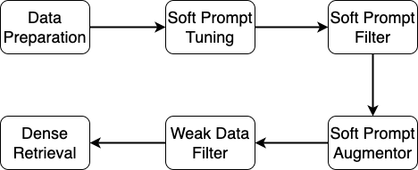

<div align="center">

# [SPTAR](https://arxiv.org/abs/2307.08303)

</div>

# What is it?
SPTAR represents `Soft Prompt Tuning for Augmenting Dense Retrieval with Large Language Models` which consists of six modules as shown in the following image:

<div align="center">

</div>

This repo consists of two floders `xuyang` and `zhiyuan` where `xuyang` contains the soft prompt tuning, soft prompt filter and soft prompt augmentor modules. `zhiyuan` contains weak data filter and dense retrieval modules. Check `xuyang`'s readme file for generating uncleaned weak document-query pairs. Follow this readme file to reproduce the results.

# Reproduce Results

## Setup py37 Env
`py37` env is for DPR, BM25CE and generating the data for ColBERT:
```
python zhiyuan/retriever/dpr/train/gen_data_for_colbert.py
```
Create `py37` env by:
```
conda env create -f environment.yml
```
If you find this error:
```
nvidia/cublas/lib/libcublas.so.11: symbol cublasLtGetStatusString version libcublasLt.so.11 not defined in file libcublasLt.so.11 with link time reference
```
Then, run the following command in your `py37` env:
```
pip uninstall nvidia_cublas_cu11
```
We modified some original files of the installed packages, so, after setting up the `py37` env, replace the following classes or functions of `zhiyuan/retriever/dpr/train/train_sbert.py`:
```
SentenceTransformer
TrainRetriever
TrainRetriever/InformationRetrievalEvaluator
```
with the corresponding files in `zhiyuan/packages/`


## Setup col37bert Env
col37bert env is for ColBERT. Create col37bert env by:
```
conda env create -f zhiyuan/retriever/col_bert/col37bert.yml
```
## Data Preparation
To make sure you have the exact same data as ours, we recommand you download our `datasets` from [Google Drive](https://drive.google.com/drive/folders/1wjwevAAORCf_vunP0OsoArfdwpP25QuO?usp=sharing) and place `datasets` under path `zhiyuan/`. Or you can download the BEIR dataset and generate the necessary files by the commands below:

```
python zhiyuan/download.py
python zhiyuan/data_process.py 
```

`zhiyuan/data_process.py` is to generate three jsonl files for each dataset:
1. zhiyuan/datasets/raw/beir/fiqa or msmarco/corpus_filtered.jsonl
2. zhiyuan/datasets/raw/beir/fiqa or msmarco/corpus_5000_reduced_ratio_20.jsonl
3. zhiyuan/datasets/raw/beir/fiqa or msmarco/corpus_100k_reduced_ratio_20.jsonl

`corpus_filtered.jsonl` stores all the unlabled documents. `corpus_5000_reduced_ratio_20.jsonl` stores the sampled small corpus for fast evaluation during DPR training when # of weak paris is 5000. Similarly, corpus_100k_reduced_ratio_20.jsonl is for fast evaluation during DPR training when # of weak paris is 100k. For ColBERT, we run the official ColBERT code and there is no evaluation after each epoch. We directly run ColBERT 20 epoches and test checkpoints (3, 5, 10, 15, 18, 20) on test dataset and report the best results. So, for ColBERT, there is no need for these sampled corpus.

## Commands

### BM25
```
# fiqa
docker pull beir/pyserini-fastapi
docker run -p 8002:8000 -it --name fiqa --rm beir/pyserini-fastapi:latest
python zhiyuan/retriever/bm25anserini/evaluate_anserini_bm25.py --dataset_name fiqa

# msmarco
docker pull beir/pyserini-fastapi 
docker run -p 8000:8000 -it --name msmarco --rm beir/pyserini-fastapi:latest
python zhiyuan/retriever/bm25anserini/evaluate_anserini_bm25.py --dataset_name msmarco
```

### W/O

#### DPR
```
# fiqa
python zhiyuan/dpr_eval.py --dataset_name fiqa --version v1 --gpu_id 0 --train_num 50 -exps no_aug

# msmarco
python zhiyuan/dpr_eval.py --dataset_name msmarco --version v1 --gpu_id 0 --train_num 50 -exps no_aug
```
Testing results are logged in `zhiyuan/retriever/dpr/train/output/no_aug/`
#### ColBERT
```
# fiqa
## gen ColBERT data (You need to run this command in py37 env)
python zhiyuan/retriever/dpr/train/gen_data_for_colbert.py --dataset_name fiqa --exp_name no_aug
## train
bash zhiyuan/retriever/col_bert/train_colbert.sh -g 0,1,2,3 -d fiqa -e no_aug -m 80 -s 4 -b 128
## test
bash zhiyuan/retriever/col_bert/test_colbert.sh -g 0,1,2,3 -d fiqa -e no_aug -p 96 -c 80

# msmarco
## gen ColBERT data (You need to run this command in py37 env)
python zhiyuan/retriever/dpr/train/gen_data_for_colbert.py --dataset_name msmarco --exp_name no_aug
## train
bash zhiyuan/retriever/col_bert/train_colbert.sh -g 0,1,2,3 -d msmarco -e no_aug -m 40 -s 2 -b 128
## test
bash zhiyuan/retriever/col_bert/test_colbert.sh -g 0,1,2,3 -d msmarco -e no_aug -p 2000 -c 40
```
Testing results of ColBERT are documented in `$LOG_DIR/test_log.txt` where `LOG_DIR` is defined in `zhiyuan/retriever/col_bert/test_colbert.sh`
#### BM25CE
```
# fiqa
docker pull beir/pyserini-fastapi 
docker run -p 8002:8000 -it --name fiqa --rm beir/pyserini-fastapi:latest
python zhiyuan/retriever/bm25ce/eval/evaluate_bm25_ce_dpr.py --dataset_name fiqa --exp_name no_aug --topk 10

# msmarco
docker pull beir/pyserini-fastapi 
docker run -p 8000:8000 -it --name msmarco --rm beir/pyserini-fastapi:latest
python zhiyuan/retriever/bm25ce/eval/evaluate_bm25_ce_dpr.py --dataset_name msmarco --exp_name no_aug --topk 10
```
Testing results are logged in `zhiyuan/retriever/bm25ce/eval/output/no_aug`

### InPars

#### DPR
```
# fiqa
python zhiyuan/dpr_eval.py --dataset_name fiqa --version v1 --gpu_id 0 --train_num 50 -exps p_written_100k_vicuna_prompt_2_filtered_70

# msmarco
python zhiyuan/dpr_eval.py --dataset_name msmarco --version v1 --gpu_id 0 --train_num 50 -exps p_written_100k_vicuna_prompt_3_filtered_30
```
#### ColBERT
```
# fiqa
## gen ColBERT data (You need to run this command in py37 env)
python zhiyuan/retriever/dpr/train/gen_data_for_colbert.py --dataset_name fiqa --exp_name p_written_100k_vicuna_prompt_2_filtered_70
## train
bash zhiyuan/retriever/col_bert/train_colbert.sh -g 0,1,2,3 -d fiqa -e p_written_100k_vicuna_prompt_2_filtered_70 -m 1200 -s 60 -b 128
## test
bash zhiyuan/retriever/col_bert/test_colbert.sh -g 0,1,2,3 -d fiqa -e p_written_100k_vicuna_prompt_2_filtered_70 -p 96 -c 120

# msmarco
## gen ColBERT data (You need to run this command in py37 env)
python zhiyuan/retriever/dpr/train/gen_data_for_colbert.py --dataset_name msmarco --exp_name p_written_100k_vicuna_prompt_3_filtered_30
## train
bash zhiyuan/retriever/col_bert/train_colbert.sh -g 0,1,2,3 -d msmarco -e p_written_100k_vicuna_prompt_3_filtered_30 -m 6300 -s 315 -b 128
## test
bash zhiyuan/retriever/col_bert/test_colbert.sh -g 0,1,2,3 -d msmarco -e p_written_100k_vicuna_prompt_3_filtered_30 -p 2000 -c 6300
```
#### BM25CE
```
# fiqa
docker pull beir/pyserini-fastapi 
docker run -p 8002:8000 -it --name fiqa --rm beir/pyserini-fastapi:latest
python zhiyuan/retriever/bm25ce/eval/evaluate_bm25_ce_dpr.py --dataset_name fiqa --exp_name p_written_100k_vicuna_prompt_2_filtered_70 --topk 30

# msmarco
docker pull beir/pyserini-fastapi 
docker run -p 8000:8000 -it --name msmarco --rm beir/pyserini-fastapi:latest
python zhiyuan/retriever/bm25ce/eval/evaluate_bm25_ce_dpr.py --dataset_name msmarco --exp_name p_written_100k_vicuna_prompt_3_filtered_30 --topk 30
```

### SPTAR

#### DPR
```
# fiqa
python zhiyuan/dpr_eval.py --dataset_name fiqa --version v1 --gpu_id 0 --train_num 50 -exps llama_7b_100k_fixed_v3_best_llama_prompt_2_filtered_70

# msmarco
python zhiyuan/dpr_eval.py --dataset_name msmarco --version v1 --gpu_id 0 --train_num 50 -exps llama_7b_100k_fixed_v4_best_llama_prompt_3_filtered_30
```
#### ColBERT
```
# fiqa
## gen ColBERT data (You need to run this command in py37 env)
python zhiyuan/retriever/dpr/train/gen_data_for_colbert.py --dataset_name fiqa --exp_name llama_7b_100k_fixed_v3_best_llama_prompt_2_filtered_70
## train
bash zhiyuan/retriever/col_bert/train_colbert.sh -g 0,1,2,3 -d fiqa -e llama_7b_100k_fixed_v3_best_llama_prompt_2_filtered_70 -m 3900 -s 195 -b 128
## test
bash zhiyuan/retriever/col_bert/test_colbert.sh -g 0,1,2,3 -d fiqa -e llama_7b_100k_fixed_v3_best_llama_prompt_2_filtered_70 -p 96 -c 975

# msmarco
## gen ColBERT data (You need to run this command in py37 env)
python zhiyuan/retriever/dpr/train/gen_data_for_colbert.py --dataset_name msmarco --exp_name llama_7b_100k_fixed_v4_best_llama_prompt_3_filtered_30
## train
bash zhiyuan/retriever/col_bert/train_colbert.sh -g 0,1,2,3 -d msmarco -e llama_7b_100k_fixed_v4_best_llama_prompt_3_filtered_30 -m 6460 -s 323 -b 128
## test
bash zhiyuan/retriever/col_bert/test_colbert.sh -g 0,1,2,3 -d msmarco -e llama_7b_100k_fixed_v4_best_llama_prompt_3_filtered_30 -p 2000 -c 6460
```
#### BM25CE
```
# fiqa
docker pull beir/pyserini-fastapi 
docker run -p 8002:8000 -it --name fiqa --rm beir/pyserini-fastapi:latest
python zhiyuan/retriever/bm25ce/eval/evaluate_bm25_ce_dpr.py --dataset_name fiqa --exp_name llama_7b_100k_fixed_v3_best_llama_prompt_2_filtered_70 --topk 50

# msmarco
docker pull beir/pyserini-fastapi 
docker run -p 8000:8000 -it --name msmarco --rm beir/pyserini-fastapi:latest
python zhiyuan/retriever/bm25ce/eval/evaluate_bm25_ce_dpr.py --dataset_name msmarco --exp_name llama_7b_100k_fixed_v4_best_llama_prompt_3_filtered_30 --topk 50
```
## Weak Data Filter Module
llama_7b_100k_fixed_v4_best_llama_prompt_3_filtered_30 comes from filtering llama_7b_100k_fixed_v4_best_llama_prompt_3 by `zhiyuan/filter/bm25anserini_split.py` with `topk=30` where llama_7b_100k_fixed_v4_best_llama_prompt_3 contains raw 100k weak document-query pairs generated by soft prompt augmentor module. 
## Official Code
BM25, DPR and ColBERT utilized in this repo are based on their offical implementations:
### [BM25](https://github.com/beir-cellar/beir/blob/main/examples/retrieval/evaluation/lexical/evaluate_anserini_bm25.py)
### [DPR](https://github.com/beir-cellar/beir/blob/main/examples/retrieval/training/train_sbert.py)
### [ColBERT](https://github.com/thakur-nandan/beir-ColBERT)
# Citing
If you find our SPTAR helpful, please cite our paper [Soft Prompt Tuning for Augmenting Dense Retrieval with Large Language Models](https://arxiv.org/abs/2307.08303):
```
@article{peng2023soft,
  title={Soft Prompt Tuning for Augmenting Dense Retrieval with Large Language Models},
  author={Peng, Zhiyuan and Wu, Xuyang and Fang, Yi},
  journal={arXiv preprint arXiv:2307.08303v2},
  year={2023}
}
```
